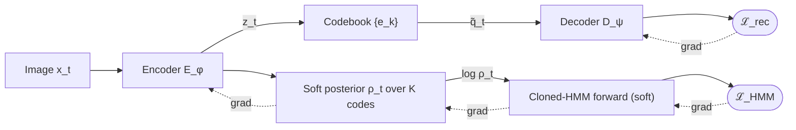
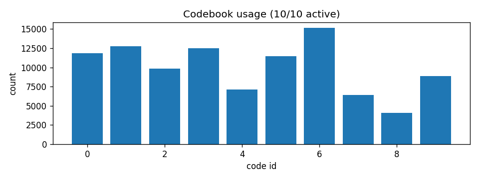
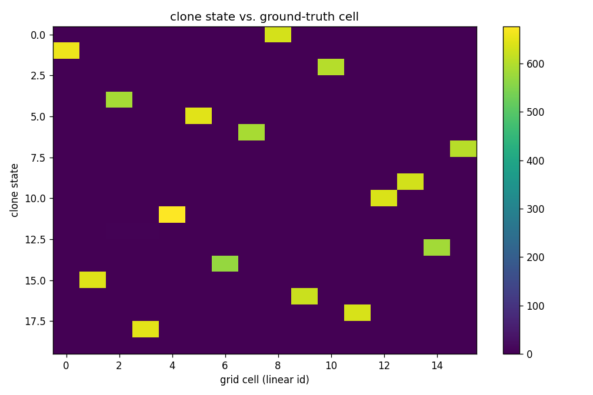
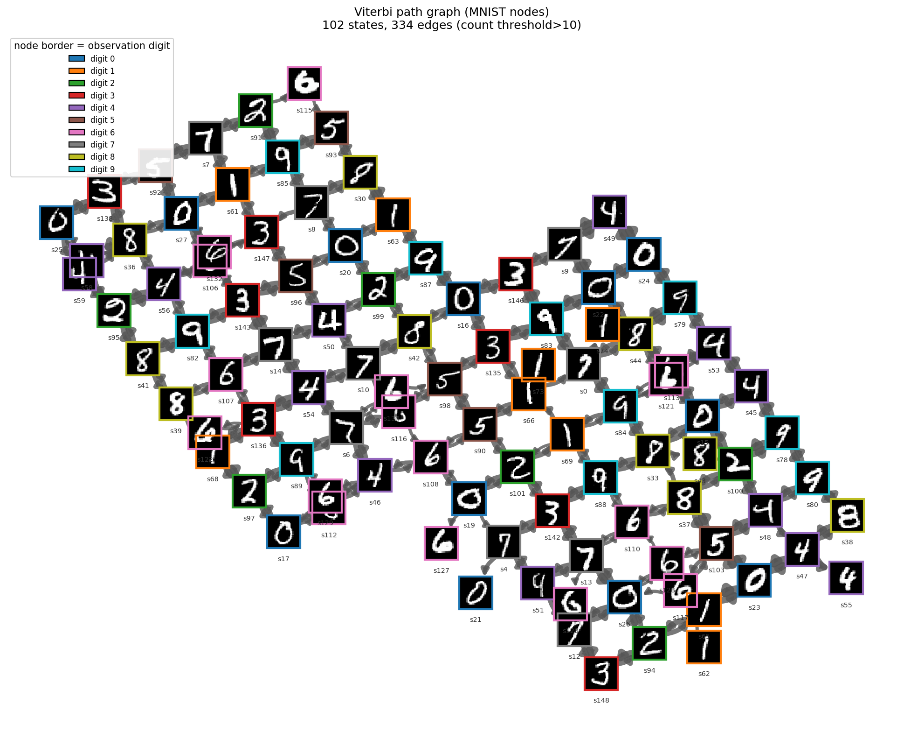

# Learning Cognitive Maps from Visual Experience: A Differentiable VQ-VAE and Gradient-Trained Cloned HMM Pipeline

**Arash Nikzad**1, **Sasan Sarbishegi**, **Ali Dasmeh**2, **Muhammad Asif**3, **Parsa Gharavi**1, **Erik Husom**4, **Sagar Sen**4, **Andrew B. Lehr**5,6, **Olivier Penacchio**7, **Ana Clemente**3, **Tristan M. Stöber**6,8,9  

1 Goethe University Frankfurt, Frankfurt, Germany  
2 Max Planck Institute for Human Development, Berlin, Germany  
3 Department of Cognitive Neuropsychology, Max Planck Institute for Empirical Aesthetics, Frankfurt, Germany  
4 SINTEF, Oslo, Norway  
5 Department of Neuro- and Sensory Physiology, University Medical Center Göttingen, Göttingen, Germany  
6 Circulant Labs, Bensheim, Germany  
7 Computer Science Department, Universitat Autònoma de Barcelona, Bellaterra, Spain  
8 Campus Institute Data Science, University of Göttingen, Göttingen, Germany  
9 Epilepsy Center Frankfurt Rhine-Main, Department of Neurology, Goethe University Frankfurt, Frankfurt, Germany
---

## Abstract

Building a structured internal model of an environment from a stream of raw observations and actions is a core problem in both machine learning and neuroscience. Sequence models such as the Clone-Structured Cognitive Graph (CSCG) can recover environment topology, but they assume a *discrete* observation alphabet; an agent that perceives pixels does not have one. We present an end-to-end pipeline that couples a VQ-VAE perceptual front-end to an action-conditioned cloned hidden Markov model (HMM) and trains the two jointly. Our key technical contribution is a differentiable, *soft-emission* formulation of the cloned-HMM forward algorithm: the encoder emits a posterior over a learned codebook, the sequence model consumes it in log-space, and gradients from the topological objective propagate back into perception. We further introduce loss-balancing mechanisms — length normalization, weight annealing, and a codebook-diversity penalty — that make joint training stable. On controlled MNIST grid-world benchmarks with strong perceptual aliasing, the pipeline recovers the physical adjacency graph with **100% edge recall**, **0.95–0.98** state-to-place purity, and best-threshold map F1 of **0.67–0.87** across five environments. We give complete formal definitions of the model, the joint objective, and the evaluation suite.

**Keywords:** cognitive maps, vector-quantized representation learning, cloned HMM, CSCG, differentiable sequence models, topology recovery.

---

## 1. Introduction

An agent moving through the world receives a stream of high-dimensional sensory observations together with a record of its own actions. From this stream alone, can it construct a *cognitive map* — a structured internal model that recovers the relational and topological structure of the environment [1]? This question is central both to machine learning, where it underlies world models and navigation, and to systems neuroscience, where the hippocampal–entorhinal system is the canonical substrate of spatial and relational maps.

Learning such a map from raw perception is hard for three coupled reasons. *(i) Perceptual aliasing:* the same place can look different across visits, and distinct places can look identical, so raw appearance is not a reliable identity signal. *(ii) Discretization:* sequence models that provably recover topology — in particular the Clone-Structured Cognitive Graph (CSCG) [2], a cloned hidden Markov model — assume a *discrete* observation alphabet, whereas a real agent observes pixels. *(iii) Cooperation:* a perception module trained only to reconstruct images has no incentive to produce *sequence-friendly* tokens, and a sequence model handed unstable tokens cannot recover structure.

Existing components address these difficulties only in isolation. The CSCG recovers topology but takes the discrete alphabet as given. The VQ-VAE [4, 5] learns a discrete codebook but optimizes reconstruction alone. **No existing pipeline trains the perceptual discretizer and the topological sequence model together so that perception becomes sequence-aware.** Closing that gap is the subject of this paper.

**Contributions.**

1. An **end-to-end pipeline** that maps raw images to a topological cognitive map by coupling a VQ-VAE to an action-conditioned cloned HMM (Section 3).
2. A **differentiable, soft-emission cloned HMM**: the forward algorithm is implemented as a differentiable log-space computation, so the sequence objective can be trained by backpropagation and gradients reach the perceptual front-end (Sections 3.3–3.5).
3. **Loss-balancing for stable joint training** — length normalization, weight annealing, a diversity penalty, and anti-collapse safeguards (Section 3.6).
4. A formal, reusable **topology-recovery evaluation suite** (Section 3.10).
5. An empirical study on five MNIST grid-world environments with strong aliasing (Sections 4–5).

---

## 2. Related Work

**Discrete representation learning.**
The VQ-VAE [4] introduced a learned discrete bottleneck trained with a straight-through estimator [6] and a commitment loss; [5] stabilized the codebook with exponential-moving-average (EMA) updates. These models optimize reconstruction; they are not trained for downstream sequential structure, which is the coupling we add.

**Cloned HMMs and cognitive maps.**
The CSCG [2] is an action-augmented cloned HMM in which each observation symbol owns several latent "clones"; clones with identical emissions but different transition contexts disambiguate perceptual aliasing and yield interpretable maps. Cloned HMMs are classically trained by Expectation–Maximization. The Tolman–Eichenbaum Machine [3] is a related neural account of relational memory. We retain the CSCG model class but make its training *gradient-based*, which is what allows it to be composed with a neural front-end.

**HMM inference.**
The forward and Viterbi algorithms [7] underlie our likelihood and decoding; our contribution is to express the forward recursion as a differentiable log-space graph and to admit *soft* emissions so that the likelihood is differentiable in the encoder output.

---

## 3. Materials and Methods

### 3.1 Problem formulation

An agent produces an episode of length $T$: observations $x_{1:T}$ with $x_t\in\mathcal{X}\subset\mathbb{R}^{H\times W\times C}$ and actions $a_{1:T-1}$ with $a_t\in\mathcal{A}=\{1,\dots,A\}$, where $a_t$ is taken between times $t$ and $t{+}1$. Each observation is emitted at an underlying physical place $g_t\in\mathcal{G}$; the environment has a true undirected adjacency graph $\mathcal{M}=(\mathcal{G},\mathcal{E})$. The places $g_t$ and edges $\mathcal{E}$ are used *only for evaluation* and are never seen during training. The goal is to learn, from $(x_{1:T},a_{1:T-1})$ alone, a latent model whose transition structure recovers $\mathcal{M}$.

The pipeline (Figure 1) has two modules: a VQ-VAE that maps each image to a discrete token, and an action-conditioned cloned HMM over those tokens whose latent graph is the learned map.

***Figure 1: The neuralCSCG pipeline.*** *Solid arrows: forward computation. Dashed arrows: gradient flow. The encoder feeds both a reconstruction branch (hard quantization $\tilde q_t$ + decoder) and a sequence branch (soft codebook posterior $\rho_t$ + differentiable cloned-HMM forward pass). Because the HMM likelihood is differentiable in $\rho_t$, the topological objective $\mathcal{L}_{\mathrm{HMM}}$ shapes the encoder. The codebook itself is updated by EMA, not by gradients.*

### 3.2 Perceptual front-end: VQ-VAE

**Encoder and quantization.**
A convolutional encoder $E_\phi:\mathcal{X}\to\mathbb{R}^{D}$ maps each image to a latent $z_t=E_\phi(x_t)$. A codebook $\{e_k\}_{k=1}^{K}$, $e_k\in\mathbb{R}^{D}$, defines a discrete token by nearest-neighbour assignment,

$$k_t=\arg\min_{k\in\{1,\dots,K\}}\;\lVert z_t-e_k\rVert_2^2, \qquad q_t=e_{k_t},$$

where the squared distance is computed as $\lVert z-e_k\rVert_2^2=\lVert z\rVert_2^2-2\langle z,e_k\rangle+\lVert e_k\rVert_2^2$. Gradients cross the non-differentiable $\arg\min$ by the straight-through estimator [6],

$$\tilde q_t = z_t + \mathrm{sg}(q_t-z_t),$$

where $\mathrm{sg}(\cdot)$ is the stop-gradient operator, so the forward value is $q_t$ while $\partial\tilde q_t/\partial z_t=I$. A decoder $D_\psi$ reconstructs $\hat x_t=D_\psi(\tilde q_t)$.

**Losses.**
Over a minibatch $\mathcal{B}$,

$$\mathcal{L}_{\mathrm{rec}} = \tfrac{1}{|\mathcal{B}|}\sum_{t} \lVert x_t-\hat x_t\rVert_2^2,$$

$$\mathcal{L}_{\mathrm{commit}} = \tfrac{1}{|\mathcal{B}|}\sum_{t} \lVert \mathrm{sg}(q_t)-z_t\rVert_2^2,$$

the second term pulling encoder outputs toward their assigned code.

**EMA codebook updates.**
The codebook is *not* trained by gradient descent. With decay $\gamma\in(0,1)$, per batch we accumulate, for every code $k$, a cluster size $n_k$ and a vector sum $m_k$,

$$\begin{aligned}
n_k &\leftarrow \gamma\,n_k+(1-\gamma)\sum_{t}\mathbb{1}[k_t=k],\\
m_k &\leftarrow \gamma\,m_k+(1-\gamma)\sum_{t}\mathbb{1}[k_t=k]\,z_t,
\end{aligned}$$

and set $e_k\leftarrow m_k/\hat n_k$ with Laplace-smoothed size

$$\hat n_k=\frac{n_k+\epsilon}{\left(\sum_{k'}n_{k'}\right)+K\epsilon}\left(\sum_{k'}n_{k'}\right).$$

**Soft codebook posterior.**
For the differentiable coupling (Section 3.5) the encoder also emits a temperature-controlled posterior over the codebook,

$$\log\rho_t(k) = \log\mathrm{softmax}_{k}\left(-\lVert z_t-e_k\rVert_2^2/\tau\right),$$

which is differentiable in $z_t$. As $\tau\to0$, $\rho_t$ concentrates on $k_t$ and this recovers the hard assignment.

### 3.3 Sequence model: action-conditioned cloned HMM

**State space and clone structure.**
Each token $k$ is assigned $C_k\ge1$ *clones* — latent states that all emit token $k$ but participate in different transition contexts. With a trailing *sink* state $\bot$, the state space is $\mathcal{S}=\{1,\dots,N\}$ with $N=1+\sum_{k=1}^{K}C_k$. A fixed map $\omega:\mathcal{S}\setminus\{\bot\}\to\{1,\dots,K\}$ gives the token each state emits; in the uniform case $C_k\equiv C$ and $\omega(s)=\lceil s/C\rceil$. Emissions are *deterministic*:

$$B_{s,o}=\mathbb{1}[\omega(s)=o],\qquad \log B_{s,o}=\begin{cases}0,&\omega(s)=o\\-\infty,&\text{otherwise,}\end{cases}$$

and the sink emits no real token. Clones are exactly the mechanism that disambiguates aliasing: one token observed at two places is explained by two clones with distinct transition rows.

**Parameters.**
The model has initial-state logits $\pi\in\mathbb{R}^{N}$ and action-conditioned transition logits $\Theta\in\mathbb{R}^{A\times N\times N}$, yielding

$$\bar\pi=\mathrm{softmax}(\pi),\qquad T_{a,i,j}=\mathrm{softmax}_{j}\left(\Theta_{a,i,\cdot}\right).$$

All learning resides in $(\pi,\Theta)$; emissions are fixed.

**Forward likelihood.**
Writing $\mathop{\mathrm{logsumexp}}_i u_i=\log\sum_i e^{u_i}$, the log-forward messages for an episode $(o_{1:T},a_{1:T-1})$ obey

$$\begin{aligned}
\log\alpha_1(j) ={}& \log\bar\pi_j+\log B_{j,o_1},\\
\log\alpha_{t+1}(j) ={}& \mathop{\mathrm{logsumexp}}_{i}\left[\log\alpha_t(i)+\log T_{a_t,i,j}\right] + \log B_{j,o_{t+1}},
\end{aligned}$$

and the episode log-likelihood is $\ell(o_{1:T}\mid a_{1:T-1})=\mathop{\mathrm{logsumexp}}_{j}\log\alpha_T(j)$. The training loss is the mean negative log-likelihood (NLL)

$$\mathcal{L}_{\mathrm{HMM}}=-\tfrac{1}{|\mathcal{B}|}\sum_{(o,a)\in\mathcal{B}}\ell(o_{1:T}\mid a_{1:T-1}).$$

### 3.4 Gradient-based training of the cloned HMM

Unlike the classical EM training of cloned HMMs, we evaluate the forward recursion and NLL loss as a single differentiable, log-space computational graph (a masked time recursion over padded minibatches) and optimize $(\pi,\Theta)$ directly by stochastic gradient descent with Adam [8]. Log-space arithmetic with $\mathop{\mathrm{logsumexp}}$ keeps the recursion numerically stable over long episodes. This gradient formulation is what makes the sequence model composable with a neural front-end.

### 3.5 Differentiable soft-emission coupling

To let the topological objective shape perception, we replace the hard emission term $\log B_{j,o_{t}}$ in the forward pass by the soft log-posterior of the token that state $j$ emits:

$$\begin{aligned}
\log\alpha^{s}_1(j) ={}& \log\bar\pi_j+\log\rho_1\left(\omega(j)\right),\\
\log\alpha^{s}_{t+1}(j) ={}& \mathop{\mathrm{logsumexp}}_{i}\left[\log\alpha^{s}_t(i)+\log T_{a_t,i,j}\right] + \log\rho_{t+1}\left(\omega(j)\right),
\end{aligned}$$

with the sink assigned $\log\rho_t(\bot)=-\infty$. The resulting log-likelihood $\ell^{s}$ is differentiable in $\rho_{1:T}$ and hence, through the soft posterior, in the encoder parameters $\phi$. Two properties hold by construction:

1. **Consistency.** If $\rho_t$ is the one-hot distribution on the observed token $o_t$, then $\log\rho_t(\omega(j))=\log B_{j,o_t}$ and the soft recursion reduces exactly to the hard forward pass. As $\tau\to0$ the soft pipeline thus recovers the hard pipeline.
2. **End-to-end differentiability.** Gradients of $\mathcal{L}_{\mathrm{HMM}}$ propagate $\ell^{s}\!\to\!\rho\!\to\!z\!\to\!\phi$, so the encoder is trained, in part, to produce tokens that make the action-conditioned sequence *explainable*.

### 3.6 Joint objective and loss balancing

**Training regimes.**
We use a deliberate progression. *Phase 1 (stagewise)* trains the VQ-VAE alone, then trains the HMM on hard tokens. *Phase 2 (joint)* optimizes encoder, decoder and $(\pi,\Theta)$ together under a combined objective. *Phase 2.5* adds loss-balancing terms that make Phase 2 stable.

**Combined objective.**
At joint step $t$,

$$\mathcal{L}_{\mathrm{joint}} = \mathcal{L}_{\mathrm{rec}} + \beta\,\mathcal{L}_{\mathrm{commit}} + \lambda_t\,\widetilde{\mathcal{L}}_{\mathrm{HMM}} + \alpha_{\mathrm{div}}\,\mathcal{L}_{\mathrm{div}}.$$

**Length normalization.**
The raw NLL grows as $O(T)$, which on long episodes dwarfs the $O(1)$ reconstruction term and collapses the codebook. We therefore use the per-step NLL

$$\widetilde{\mathcal{L}}_{\mathrm{HMM}}=-\tfrac{1}{|\mathcal{B}|}\sum \tfrac{1}{T}\,\ell^{s}(o_{1:T}\mid a_{1:T-1}).$$

**Weight annealing.**
The sequence-loss weight is ramped linearly so the codebook stabilizes under reconstruction before topological pressure turns on:

$$\lambda_t=\lambda\cdot\min\left(1,\;t/T_{\mathrm{anneal}}\right).$$

**Diversity penalty.**
Let $\bar\rho(k)=\frac{1}{|\mathcal{B}|}\sum_t\rho_t(k)$ be mean codebook usage and $H(\bar\rho)=-\sum_k\bar\rho(k)\log\bar\rho(k)$ its entropy. The penalty

$$\mathcal{L}_{\mathrm{div}}=\log K-H(\bar\rho)\;\ge\;0$$

vanishes only at uniform usage and counteracts codebook collapse.

**Anti-collapse safeguards and finalization.**
During Phase 2 we monitor codebook perplexity and keep the highest-perplexity checkpoint; optional $\lambda$-throttling, rollback, and dead-code revival provide further protection. A short *finalization* phase then freezes the encoder and refines $(\pi,\Theta)$ on hard tokens with the unnormalized loss, optionally with a transition-entropy regularizer $-\eta\sum_{a,i}H(T_{a,i,\cdot})$ to sharpen transition rows. Algorithm 1 summarizes one joint step.

> **Algorithm 1 — One joint training step**
>
> **Require:** image chunk $x_{1:T}$, actions $a_{1:T-1}$, weights $\beta,\lambda_t,\alpha_{\mathrm{div}}$, temperature $\tau$
>
> 1. $z_t \gets E_\phi(x_t)$ &nbsp; *(encode)*
> 2. $q_t,\tilde q_t \gets \text{quantize}(z_t)$; update codebook by EMA
> 3. $\hat x_t \gets D_\psi(\tilde q_t)$; &nbsp; $\mathcal{L}_{\mathrm{rec}},\mathcal{L}_{\mathrm{commit}} \gets$ Eq. (3)–(4)
> 4. $\log\rho_t \gets \log\mathrm{softmax}(-\lVert z_t-e_\cdot\rVert^2/\tau)$
> 5. $\ell^{s}\gets$ soft forward pass, Eq. (12)–(13)
> 6. $\widetilde{\mathcal{L}}_{\mathrm{HMM}}\gets -\ell^{s}/T$; &nbsp; $\mathcal{L}_{\mathrm{div}}\gets \log K-H(\bar\rho)$
> 7. $\mathcal{L}_{\mathrm{joint}}\gets$ Eq. (11)
> 8. update $(\phi,\psi,\pi,\Theta)$ with Adam on $\nabla\mathcal{L}_{\mathrm{joint}}$

### 3.7 Decoding

The maximum-a-posteriori state path is obtained by the Viterbi recursion [7]:

$$\begin{aligned}
\delta_1(j) &= \log\bar\pi_j+\log B_{j,o_1},\\
\delta_{t+1}(j) &= \max_{i}\left[\delta_t(i)+\log T_{a_t,i,j}\right] + \log B_{j,o_{t+1}},
\end{aligned}$$

with backpointers $\psi_{t+1}(j)=\arg\max_i[\delta_t(i)+\log T_{a_t,i,j}]$ and traceback $s^\star_T=\arg\max_j\delta_T(j)$, $s^\star_t=\psi_{t+1}(s^\star_{t+1})$. The decoded path $s^\star_{1:T}$ is the basis of all evaluation.

### 3.8 Token compaction and clone allocation

In Phase 1, codes never emitted by the trained encoder are pruned and the alphabet is relabelled to the active set. Clone counts $C_k$ may be uniform or allocated per token (*dynamic clone allocation*); the deterministic emission structure of Section 3.3 is unchanged.

### 3.9 Evaluation metrics

All metrics are computed from the decoded path $s^\star_{1:T}$ of a held-out episode together with the ground-truth places $g_{1:T}$ and edges $\mathcal{E}$ (used only here, never in training). Let $\mathcal{V}$ be the set of visited states and $n(s,g)=\sharp\{t:s^\star_t=s,\;g_t=g\}$.

**State-to-place assignment.**
Each visited state is mapped to its majority place, $\chi(s)=\arg\max_{g}n(s,g)$.

**Clone purity.**

$$\mathrm{Purity}=\frac{1}{|\mathcal{V}|}\sum_{s\in\mathcal{V}}\frac{\max_g n(s,g)}{\sum_g n(s,g)},$$

with the visit-weighted variant $\sum_s\max_g n(s,g)\,/\,T$. High purity means clone states correspond cleanly to single physical places.

**Projected map and edge F1.**
Latent transitions are projected onto a place graph by

$$W(g,g')=\max_{a}\;\max_{\substack{i,j\in\mathcal{V}\\ \chi(i)=g,\;\chi(j)=g'}}T_{a,i,j},$$

and thresholded into a learned edge set $\widehat{\mathcal{E}}(\eta)=\{(g,g'):g\neq g',\,W(g,g')>\eta\}$. With $\mathrm{tp}=\lvert\widehat{\mathcal{E}}\cap\mathcal{E}\rvert$, precision, recall and F1 are defined in the usual way. We report F1 over a threshold sweep $\eta\in\{0.01,0.05,0.1,0.2,0.3\}$.

**Action-next-cell accuracy.**
For every represented place $g$ and action $a$, the predicted next place $\arg\max_{g'}W_a(g,g')$ is compared with the environment's true successor $\mathrm{next}(g,a)$.

**Token–place entropies.**
From the empirical token/place co-occurrence we report $H(\text{token}\mid\text{place})$ and $H(\text{place}\mid\text{token})$; the former is small when perception is consistent, the latter reflects the (irreducible) aliasing of the environment.

### 3.10 Implementation and hyperparameters

The encoder is three convolutional layers (strides $2,2,1$) followed by global average pooling and a dense projection to $\mathbb{R}^{D}$; the decoder mirrors it. The HMM forward pass, soft forward pass and training steps are implemented as compiled TensorFlow graphs; Viterbi decoding is eager. Transition logits are initialized with a bias toward the sink state so probability mass is well-defined before training. Table 1 lists all hyperparameters.

**Table 1.** Hyperparameters. Ranges span the five environments of Section 4.

| Component / parameter | Symbol | Value |
|---|---|---|
| ***VQ-VAE*** | | |
| Codebook size | $K$ | 4–10 |
| Embedding dimension | $D$ | 32 |
| Encoder base width | — | 32 |
| Commitment weight | $\beta$ | 0.25 |
| EMA decay | $\gamma$ | 0.99 |
| EMA smoothing | $\epsilon$ | $10^{-5}$ |
| ***Cloned HMM / CSCG*** | | |
| Action alphabet | $A$ | 4 |
| Clones per token | $C_k$ | 5–20 |
| Latent states | $N$ | 21–201 |
| ***Joint training (Phase 2 / 2.5)*** | | |
| Softmax temperature | $\tau$ | 1.0 |
| HMM-loss weight | $\lambda$ | 1.0 |
| Anneal horizon | $T_{\mathrm{anneal}}$ | iters/4 |
| Diversity weight | $\alpha_{\mathrm{div}}$ | 0.1 |
| HMM learning-rate factor | — | 100 |
| Chunk length | $T$ | 256 |
| Joint minibatch | $\lvert\mathcal{B}\rvert$ | 4 |
| Joint iterations | — | 2000–5000 |
| ***Finalization*** | | |
| Iterations | — | 1000–5000 |
| Transition-entropy weight | $\eta$ | $10^{-3}$ |
| Minibatch | — | 8 |
| ***Optimization and data*** | | |
| Optimizer | — | Adam [8] |
| VQ-VAE / joint learning rate | — | $3\times10^{-4}$ |
| Finalization learning rate | — | $10^{-2}$ |
| Episodes × steps | — | $(4\text{–}10)\times10{,}000$ |

---

## 4. Experimental Setup

### 4.1 The MNIST grid-world benchmark

The benchmark is a 2-D grid in which every cell carries a digit class. *Visiting a cell returns a randomly drawn MNIST image [9] of that digit*, so the same place never looks identical twice and cells sharing a digit are perceptually aliased. The agent has four actions (up, down, left, right) with sticky walls. Ground-truth topology is known exactly, which makes the benchmark a controlled testbed for topology recovery.

### 4.2 Environments

We study five environments of increasing difficulty (Table 2): `aliased`, a $4\times4$ grid in which four digits each recur four times; `corridors`, a $5\times5$ grid with walls and repeated digits; two $6\times6$ rooms differing in clone allocation; and `two_rooms`, a $13\times9$ map of two offset, interconnected rooms — the largest and most aliased case.

**Table 2.** Benchmark environments.

| Environment | Grid | Tokens $K$ | States $N$ |
|---|---|:---:|:---:|
| `aliased` | $4\times4$ | 4 | 21 |
| `corridors` | $5\times5$ | 6 | 31 |
| `room` (uniform) | $6\times6$ | 10 | 201 |
| `room` (dynamic) | $6\times6$ | 10 | 57 |
| `two_rooms` | $13\times9$ | 10 | 151 |

### 4.3 Protocol

Trajectories are action-conditioned random walks (4–10 episodes of 10,000 steps). Each run executes VQ-VAE warmup, joint training (Phase 2/2.5) and finalization, then is evaluated on a held-out episode with the metrics of Section 3.9. An optional, benchmark-only auxiliary digit-classification loss may be used during VQ-VAE warmup; it is disableable, since in a general environment object classes are unknown.

---

## 5. Results

### 5.1 Perceptual discretization

The VQ-VAE produces a clean, near-deterministic discretization. Across environments, mean tokens per cell is 1.0–1.2 and the conditional entropy $H(\text{token}\mid\text{place})$ is 0.09–0.23 nats: a place almost always emits a single token despite never being seen twice. Codebook perplexity tracks the number of digit classes (Figure 2), and reconstructions remain faithful (Figure 3), confirming that the codebook does not collapse under the joint objective.

*Figure 2: Codebook utilization for `two_rooms`: all codes remain active; perplexity does not collapse during joint training.*

*Figure 3: Inputs (top) and VQ-VAE reconstructions (bottom) with the assigned token id. Reconstruction stays meaningful throughout joint training.*

### 5.2 Clone-state purity

Decoded clone states map cleanly to physical places. The visit-weighted state-to-place purity is 0.95–0.98 across the four fully scored environments (Table 4), and every visited place is represented by at least one clone (Figure 4). The decoded clone graph (Figure 5) exposes the recovered topology directly: nodes are clone states drawn as the MNIST digit they represent, and edges are the action-conditioned transitions actually taken.

*Figure 4: Clone-state purity for `two_rooms`. Each decoded clone state (row) is shown against the ground-truth places it is decoded at (columns); almost every clone concentrates on a single place, which is the high visit-weighted state-to-place purity reported in Table 4.*

*Figure 5: Decoded clone-state graph for `two_rooms`; each node is drawn as an MNIST sample of the digit it represents, edges are Viterbi-path transitions. The two-room layout is visible in the latent graph.*

### 5.3 Topological map recovery

The central result is that the learned latent graph *contains* the true environment graph. Map-edge **recall is 1.00 in every scored run** — no physical adjacency is missed. The open difficulty is precision: at a low threshold the projected graph also includes many weak false edges. A threshold sweep makes the trade-off explicit (Table 3): on `corridors`, precision rises from 0.24 at $\eta=0.01$ to 0.77 at $\eta=0.3$ while recall stays at 1.00, lifting F1 to 0.87. The best-threshold F1 is 0.67–0.87 across environments (Table 4).

**Table 3.** Edge-threshold sweep on `corridors`. Recall is 1.00 throughout; precision and F1 increase with the threshold $\eta$.

| $\eta$ | 0.01 | 0.05 | 0.10 | 0.30 |
|---|:---:|:---:|:---:|:---:|
| Precision | 0.24 | 0.29 | 0.39 | 0.77 |
| Recall | 1.00 | 1.00 | 1.00 | 1.00 |
| F1 | 0.39 | 0.45 | 0.56 | **0.87** |

### 5.4 Cross-environment summary

Table 4 collects all results. The pipeline succeeds on every environment, including the largest (`two_rooms`, $13\times9$): clone purity 0.83–0.90, state-to-place purity 0.95–0.98, action-outcome accuracy 0.94–1.00, recall 1.00, and best-threshold map F1 0.67–0.87.

**Table 4.** Main results. All runs use the full Phase 2 → finalization pipeline. "State→place purity" is visit-weighted. "Recall" and "Best F1" are map-edge metrics; recall is reported at $\eta=0.01$ and best F1 over the sweep of Table 3. The `aliased` run predates the map-recovery suite (†); it is the cleanest perception case (exactly one token per cell, perplexity $=K$).

| Environment | Grid | $K$ | $N$ | Perplexity | Clone purity | State→place purity | Action acc. | Map recall | Best map F1 |
|---|---|:---:|:---:|:---:|:---:|:---:|:---:|:---:|:---:|
| `aliased` | $4\times4$ | 4 | 21 | 4.00 | 0.84 | —† | —† | —† | —† |
| `corridors` | $5\times5$ | 6 | 31 | 5.71 | 0.86 | 0.98 | **1.00** | 1.00 | **0.87** |
| `room` (uniform) | $6\times6$ | 10 | 201 | 6.63 | **0.90** | 0.98 | 0.94 | 1.00 | 0.67 |
| `room` (dynamic) | $6\times6$ | 10 | 57 | 6.56 | 0.83 | 0.95 | 0.97 | 1.00 | 0.85 |
| `two_rooms` | $13\times9$ | 10 | 151 | 9.46 | 0.88 | 0.98 | 0.99 | 1.00 | 0.86 |

### 5.5 Training dynamics

Figure 6 shows the loss trajectories. Reconstruction is stable across joint training; the length-normalized HMM term decreases steadily once $\lambda_t$ ramps in; and the finalization phase produces a further sharp drop in HMM NLL with the encoder frozen — consistent with the role of the balancing terms in Section 3.6.

*Figure 6: Training curves for `two_rooms`: VQ-VAE warmup, joint-phase components (reconstruction, commitment, length-normalized HMM term, diversity), and the pure-HMM finalization phase.*

---

## 6. Discussion

The experiments support the paper's central claim: topology recovery emerges from the *interaction* of the two modules, not from either alone. Perception must discretize finely enough for sequence learning; the cloned HMM must use action context to disambiguate aliasing; and the resulting latent graph must align with physical adjacency. Empirically, the encoder converges to roughly one token per place ($H(\text{token}\mid\text{place})\le0.23$ nats), the clones absorb the aliasing (state-to-place purity $\ge0.95$), and the learned graph contains the entire true map (recall 1.00). The soft-emission coupling (Section 3.5) is the mechanism that lets the topological objective influence perception, and the loss-balancing terms (Section 3.6) are what make that coupling trainable: without length normalization and the diversity penalty, joint training collapses the codebook.

---

## 7. Limitations

Three limitations should be stated plainly. *(i) Precision.* The learned graph recovers every true edge but also adds weak false edges; high F1 currently depends on selecting an edge threshold. Threshold-free sharpening — stronger transition-entropy regularization, edge calibration — is the immediate next step. *(ii) Scope.* Results are on a controlled MNIST grid-world; a 3-D, image-based environment is future work. *(iii) Supervision.* A benchmark-only digit-classification loss is available for the VQ-VAE warmup; the long-term claim must rest on the fully unsupervised front-end, which the framework supports but which we have not exhaustively characterized here.

---

## 8. Conclusion

We presented neuralCSCG, an end-to-end pipeline that learns the topological cognitive map of an environment directly from streams of images and actions. The technical core is a differentiable, soft-emission cloned HMM whose forward algorithm propagates gradients into a VQ-VAE perceptual front-end, together with loss-balancing mechanisms that make joint training stable. On five MNIST grid-world environments with strong perceptual aliasing the method recovers the physical adjacency graph with perfect edge recall, high state-to-place purity, and best-threshold map F1 of 0.67–0.87. The remaining frontier is edge precision and the move to richer, three-dimensional environments.

**Code and data availability.** The implementation, benchmark environments, training scripts and evaluation suite are available in the project repository.

---

## References

1. E. C. Tolman. Cognitive maps in rats and men. *Psychological Review*, 55(4):189–208, 1948.
2. D. George, R. V. Rikhye, N. Gothoskar, J. S. Guntupalli, A. Dedieu, and M. Lázaro-Gredilla. Clone-structured graph representations enable flexible learning and vicarious evaluation of cognitive maps. *Nature Communications*, 12:2392, 2021.
3. J. C. R. Whittington, T. H. Muller, S. Mark, G. Chen, C. Barry, N. Burgess, and T. E. J. Behrens. The Tolman–Eichenbaum Machine: unifying space and relational memory through generalization in the hippocampal formation. *Cell*, 183(5):1249–1263, 2020.
4. A. van den Oord, O. Vinyals, and K. Kavukcuoglu. Neural discrete representation learning. In *Advances in Neural Information Processing Systems (NeurIPS)*, 2017.
5. A. Razavi, A. van den Oord, and O. Vinyals. Generating diverse high-fidelity images with VQ-VAE-2. In *Advances in Neural Information Processing Systems (NeurIPS)*, 2019.
6. Y. Bengio, N. Léonard, and A. Courville. Estimating or propagating gradients through stochastic neurons for conditional computation. *arXiv:1308.3432*, 2013.
7. L. R. Rabiner. A tutorial on hidden Markov models and selected applications in speech recognition. *Proceedings of the IEEE*, 77(2):257–286, 1989.
8. D. P. Kingma and J. Ba. Adam: a method for stochastic optimization. In *International Conference on Learning Representations (ICLR)*, 2015.
9. Y. LeCun, L. Bottou, Y. Bengio, and P. Haffner. Gradient-based learning applied to document recognition. *Proceedings of the IEEE*, 86(11):2278–2324, 1998.
